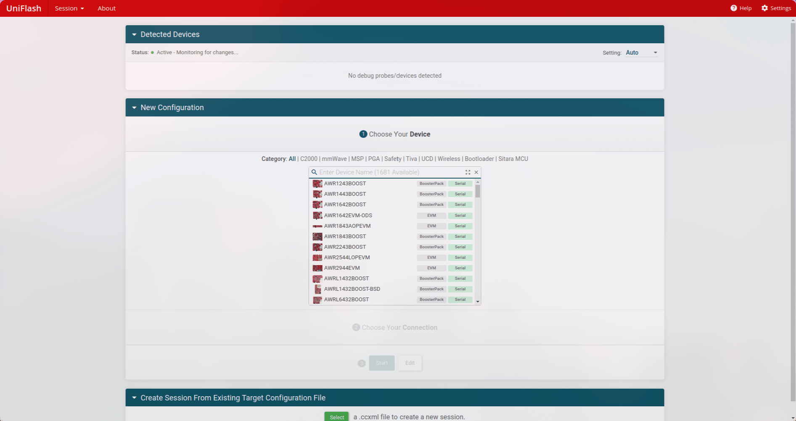

import { Steps } from '@astrojs/starlight/components';

The following is a simple guide for building the app for the OBC and flashing.

## Compiling for the OBC
<Steps>
1. Before compiling, ensure that the Python virtual environment is activated. If you do not have this configured, see [Initial setup](/OBC-firmware/start-here/setup/).
2. From the root directory, run the following commands:
    ```shell
    mkdir -p build_arm && cd build_arm
    cmake .. -DCMAKE_BUILD_TYPE=OBC
    cmake --build .
    ```

    :::tip[Tip: Reducing Build Time]{icon="setting"}
    The `cmake --build .` takes some time to run since it is using a single thread to compile. To speed up the process we can replace it with one of the following commands:
    1. `make -j 16` (Recommended for most systems)
    2. `make -j 32` (This is faster but depends on if your system can handle 32 parallel jobs)
    :::
3. There are also plenty of extra options that you can use besides `-DCMAKE_BUILD_TYPE` by appending them to the `cmake ..` command. Take a look at the [CMake options guide](/OBC-firmware/builds/cmake-options/).

    :::caution
    Make sure to specify the `-DBOARD_TYPE=` option to avoid any unwanted behavior
    :::
</Steps>

## Flashing to the OBC
There are two main ways to flash to the OBC: **using the bootloader** or **using UniFlash**. UniFlash is the more common way so let's go over that first.

### Flashing via UniFlash
<Steps>
1. When you open UniFlash you should be greeted with the following screen...

    
2. For the chip select `RM46L852` if you are using *OBC Revision 1* or *OBC Revision 2*. If you are using the *Launchpad*, select `LAUNCHXL2-RM46`.
3. Then for the connection, choose `Texas Instruments XDS110 USB Debug Probe`
4. Now press `Start` and you should see the following screen.

    
5. Browse for the file with a `.out` suffix that you would like to flash and then press `Load Image`. Usually you will flash one of the following files...
    * `OBC-firmware.out` in the `build_arm` directory >> This contains the main app to run on the OBC.
    * `OBC-bl.out` in the `build_arm` directory >> This contains the bootloader for the OBC.
    * An OBC example file from the `build_examples` directory >> This is for when you want to test specific functionality on the OBC (assuming you have written a test file for it and added it to the build script; see [Building examples](/OBC-firmware/builds/build-examples/)).
    :::note
    UniFlash may get stuck sometimes and throw errors. In such cases, navigate to session on the top red bar and start a new session. You will have to reconfigure UniFlash but it should start working again.
    :::
</Steps>

### Accessing UART
This is an important skill everyone should know just for debugging. We will go through the process for Windows and Linux.

#### Base setup
Both Linux and Windows have a program called `puTTY` available to download. `puTTY` is a great program to detect serial activity on ports so make sure you download this before proceeding!

<Steps>
1. Download and open `puTTY`. You should be greeted with the following screen...

    
2. Under the `Connection Type:` section, select the `Serial` option which should make `puTTY` show the following.

    

3. You can set the speed to `115200` which is the baud rate at the time of writing this tutorial (August, 2025). Update this rate if the baud rate of the board is increased!
4. If you know how to detect what USB port is connected to UART you can type that USB port into the `Serial line` field in `puTTY`. If you need help, read through the following sections!
5. You can then press the `Open` button and there should be a black screen that starts printing out text sent by the board!
</Steps>

#### Finding USB port on Linux
On Linux the port name will be in the form of `/dev/tty*`. For example the port could be named `/dev/ttyACM0` or `/dev/ttyUSB0`. To find the port connected to the board do the following...
<Steps>
1. Open up a terminal without the board connected and type in the following command that will list out all file paths starting with `/dev/tty`
    ```shell
    ls /dev/tty*
    ```
2. Now connect the board and repeat the same command.
3. Look for differences in outputs between running the command before and after connecting the board. The `/dev/tty` file path that gets added the second time around is the port that your board is connected on!
4. You can type the name of the port you have determined to be going to the board in the `Serial line` field in `puTTY`. If you are using JTAG and have to connect two USBs to your Linux system, you will have to experiment and see which port outputs logs on puTTY.
</Steps>

#### Finding USB port on Windows
On Windows the port name will be in the form of `COMXX` with `XX` denoting numbers. For example possible port names are `COM1`, `COM12`, etc. To find the port connected to the board do the following...
<Steps>
1. Open `Device Manager` and you should be greeted with the following (the image is taken off the web so your window may look a bit different)...
    
2. Under `Ports` try to find the COM port labelled with `UART` somewhere in it's name. Once you have found it that is the COM port you will be using in `puTTY`.
</Steps>

### Working with USB on WSL (`usbipd`)
Unfortunately Windows does not pass-through USB ports by default to WSL. Thus, we have to use a utility called `usbipd` to handle USB device pass-through in WSL. The following are the steps needed to attach/detach USB devices from WSL.

<Steps>
1. Open a `PowerShell` window. Within the window type the following command to find the bus-id of the USB device that you want to attach.

    ```shell title="PowerShell"
    usbipd list
    ```
    You need to locate the device that has UART in it's name and make note of the busid that will show in the left most column of the command's output.
2. If the device's `STATE` shows up as `shared`, you may skip this step else execute the command. The example is using the busid of `1-1` for demonstration purposes

    ```shell title="PowerShell"
    usbipd bind --busid 1-1
    ```
3. If the device's `STATE` shows up as `attached`, you may skip this step else execute the command. Again this example uses a busid of `1-1` for demonstration purposes.
    ```shell title="PowerShell"

    usbipd attach --wsl --busid 1-1
    ```
4. If you ever need to detach the USB port (to use `puTTY` for example) then you can run the following command. Again this example uses a busid of `1-1` for demonstration purposes.

    ```shell title="PowerShell"
    usbipd detach --busid 1-1
    ```
</Steps>


### Flashing via the bootloader
<Steps>
1. Use UniFlash to flash the `OBC-bl.out` file, ensuring you have built it for the correct board using the right argument for the `-DBOARD_TYPE=` option.
2. From the root directory activate the python virtual environment with the following command

    ```shell
    source venv/bin/activate
    ```
3. Navigate to the `obc/tools/python/` directory from root...
    ```shell
    cd obc/tools/python/
    ```
4. Run the app `app_update.py` script specifying a USB port and the absolute file path. The following are some examples.
    ```shell
    # On Linux and WSL
    python3 app_update.py /dev/ttyS0 ~/OBC-firmware/build_arm/OBC-firmware.bin

    # On Linux and WSL
    python3 app_update.py /dev/ttyUSB0 ~/OBC-firmware/build_arm/OBC-firmware.bin
    ```
    :::note
    The bootloader sends messages through the UART port so if the first string that the script displays is not 'Erase Successful' or the script is takes more than 1 second to start, re-run the script. Hopefully this is addressed in the future!
    :::
5. Wait for the script to flash and the board should jump to app within 2 seconds of when flashing is completed. If not check the error that is being logged to UART and try again!
</Steps>
