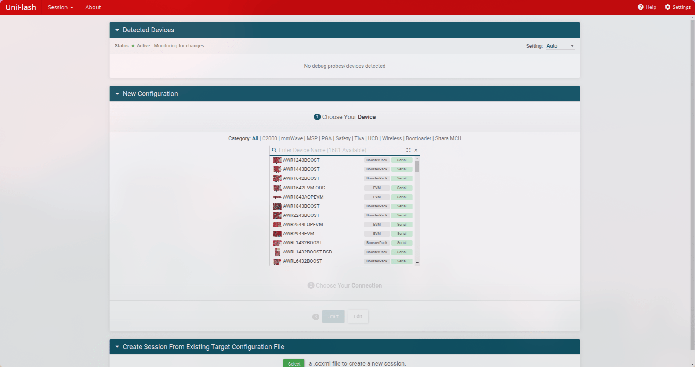
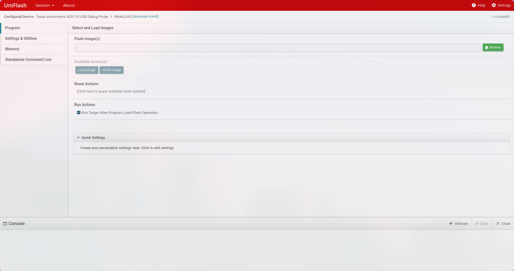

The following is a simple guide for building the app for the OBC and flashing.

## Compiling for the OBC
1. From the root directory you can run the following commands
    ```shell
    mkdir -p build_arm && cd build_arm
    cmake .. -DCMAKE_BUILD_TYPE=OBC
    cmake --build .
    ```

    :::tip[Tip: Reducing Build Time]{icon="setting"}
    The `cmake --build .` takes some time to run since it is using a single thread to compile. To speed up the process we can use one of the following commands
    1. `make -j 16` (Recommended for most systems)
    2. `make -j 32` (This is faster but depends on if your system can handle 32 parallel jobs)
    :::
2. There are also plenty of extra options that you can use besides `-DCMAKE_BUILD_TYPE` by appending them to the `cmake ..` command. Take a look at the [CMake Options Guide](/OBC-firmware/getting-started/cmake-options/).

    :::caution
    Make sure to specify the `-DBOARD_TYPE=` option to avoid any unwanted behavior
    :::

## Flashing to the OBC
There are two main ways to flash to the OBC: **using the bootloader** or **using UniFlash**. UniFlash is the more common way so let's go over that first.

### Flashing Via UniFlash
1. When you open UniFlash you should be greeted with the following screen...

    
2. For the chip select `RM46L852` if you are using OBC Revision 1 or OBC Revision 2. If you are using the Launchpad, seletc `LAUNCHXL2-RM46`.
3. Then for the connection, choose `Texas Instruments XDS110 USB Debug Probe`
4. Now press `Start` and you should see the following screen.

    
5. Browse for the file you would like to flash and then press `Load Image`.
    :::note
    UniFlash may get stuck sometimes and throw errors. In such cases, navigate to session on the top red bar and start a new session. You will have to reconfigure UniFlash but it should get working again.
    :::
### Flashing Via the Bootloader (WIP)
1. Use UniFlash to flash the `OBC-bl.out` file, ensuring you have built it for the correct board using the right argument for the `-DBOARD_TYPE=` option.
2. From the root directory activate the python virtual environment with the following command

    ```shell
    source venv/bin/activate
    ```

